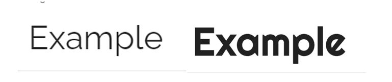

## Gitpod Reminders

To run a frontend (HTML, CSS, Javascript only) application in Gitpod, in the terminal, type:

`python3 -m http.server`

------

  

 

  

 

[Pairs of the World](https://mair-e.github.io/MileStoneProject2/) is designed as an online interactive game with matching pairs as its main feature. Its goal is to stimulate and entertain the user as well as educate the user on where geographical landmarks can be found around the world. I wanted to create a game that was more intriguing, with a level of difficulty rather than just matching identical pairs. 

## Table of Contents
1. 

    
<a href="#ux">UX</a>

    <ul>
    <li>

    
<a href="#goals">Goals</a>

    - [Visitor Goals](#visitor-goals)
    - [Business Goals](#business-goals)
    - [User Stories](#user-stories)
    
</li>

    <li>

    
<a href="#visual-design">Visual Design</a>

    - [Wireframes](#wireframes)
    - [Fonts](#fonts)
    - [Icons](#icons)
    - [Colors](#colors)
    - [Images](#images)
    
</li>
    </ul>

2. 

    
<a href="#features">Features</a>

    <ul>
    <li>

    
<a href="#page-elements">Page Elements</a>

    - [Main Page](#main-pages)
    - [Pop Up](#pop-up)
    
</li>

    <li>

    
<a href="#feature-ideas">Feature Ideas</a>

    - [Basic](#basic)
    - [Content](#content)
    
</li>
    </ul>

3. 

    
<a href="#technologies-used">Technologies Used</a>

    - [Languages](#languages)
    - [Frameworks](#frameworks)
    - [Libraries](#libraries)
    - [Platforms](#platforms)
    - [Other Tools](#other-tools)

4. 

    
<a href="#testing">Testing</a>

    <ul>
    <li>

    
<a href="#methods">Methods</a>

    - [Validation](#validation)
    - [General Testing](#general-testing)
    - [Mobile Testing](#mobile-testing)
    - [Desktop Testing](#desktop-testing)
    
</li>

    <li>

    
<a href="#bugs">Bugs</a>

    - [Known Bugs](#known-bugs)
    - [Fixed Bugs](#fixed-bugs)
    
</li>
    </ul>

5. 

    
<a href="#deployment">Deployment</a>

    <ul>
    <li>

    
<a href="#local-deployment">Local Deployment</a>

    - [Local Preparation](#local-preparation)
    - [Local Instructions](#local-instructions)
    
</li>

    <li>

    
<a href="#github-deployment">Github Deployment</a>

    - [Github Preparation](#github-preparation)
    - [Github Instructions](#github-instructions)
    
</li>
    </ul>

6. 

    
<a href="#credit-and-contact">Credit and Contact</a>

    - [Content](#content)
    - [Contact](#contact)

# UX
## Goals
### Visitor Goals
The target audience for Pair of the World are:
- People who are interested in travel and geography.
- People who want to play an educational game.
- People who fancy having a bit of fun! 

User goals are:
- Easily work out what the goal of the game is.
- See the rules of the game.
- Have it clearly identified if the chosen two cards match or not.
- Contact the game developer.

Pairs of the World fills these needs by:
- You can find the game goal (Match the country flag to the country landmark) on the main page and the pop up instructions window.
- The ‘How To Play’ button is clearly displayed and opens a pop up window in front of the game.
- When two cards match or do not match, a clear message pops up to tell the user.
- Providing social media links to the game developer, myself.

### User Stories
1. As a user interested in educational games, I expect to play a memory card match game that teaches me famous landmarks in different countries.
XXX
XXX
XXX

## Visual Design
### Wireframes
I created wireframes to assist me when building my HTML page layout.
 

As the process of creating the website went on I adapted the pages to utilise html, css and javascript that I was more comfortable using as well as made the page look more user friendly. I created updated wireframes to show this.

### Fonts

  

- The primary font, Raleway, was chosen as it is standard and clearly read. Its not too rigid so friendly to the user and can be easily distinguished on different colour backgrounds.
- The secondary font, Righteous, was chosen as it is more thicker and more playfuil than the primary font so can be used for text that is shorter and impactful.

### Icons

  

- Icons are taken from the [Fontawesome](https://fontawesome.com/) Icon library and are utilised as classes in the `<i>` tag.
- As they are utilised as classes, they can easily be styled using other classes or IDs in the same tag. I often used Bootstrap classes to style them uniformly.
- I have used the linked in icon in the footer for my social account.

### Colors

  

- I wanted the site to maintain a friendly, playful colour scheme that related to the game so followed the colours of a globe of the earth. 
- I then used darker colours to ensure text was clear and ensures accessibility, for example in the title and background of the buttons. 
- By having faded backgrounds rather than block colours I also enabled the user to have a view of the game to match up with the instructions as they are reading them.

----

# Features
## Page Elements
### Game Page
The game page is where all the elements come together for the game to be played out.

- The page loads with the start of the game where is displays the back of the randomised cards so user is unaware where the pairs are.
- User will click the How To Play button where the goal of the game and instructions will popup.
- User will then close this popup banner.
- The user then clicks on two cards and an alert will tell them if a match or to try again. 
- As the user matches cards of country flags to their landmarks the match counter will increase and when all cards are matched (8 pairs) a congratulations alert will appear and the game complete. 
- To reset the board and play again the user will click the New Game button.

#### Game Logo
The game logo consists of a cartoon globe of the earth with open arms to welcome users to the page. It is followed by the page and game title.

[Game logo image](/assets/imagesrm/logoscreenshot.jpg)

[Game title image](/assets/imagesrm/titlescreenshot.jpg)

#### Game Section
The game section is split up into the cards grid and underneath a New Game and How To Play buttons.
The cards and buttons are fully responsive, javascript backed, allowing the user to click to flip and match cards aswell as start restart game.

The cards grid has four columns and rows, no matter the device size, so all cards are nicely displayed.

[Card Grid image](/assets/imagesrm/cardgridscreenshot.jpg)

[Buttons image](/assets/imagesrm/buttonsscreenshot.jpg)

#### Footer
The footer is present at the bottom of the page and provides links to my social media profile and the github repository of the game. When on a desktop device using a pointer, the links are animated with CSS to draw attention on hover.

[Footer image](/assets/imagesrm/footer.jpg)

#### How to Play Popup 
The How to Play full width banner appears when the How To Play button is clicked and gives the player the goal of the game, to match the country flag to its landark, and the istructions of how to play the game.
The pop up is fixed so is visible at whichever point of the page you are scrolled to.

[How to Play Popup image](/assets/imagesrm/popupscreenshot.jpg)

### Match/No match message

Two individual alert messages appear to tell the player if they have a correct match or to try again, as well as when all cards are matched a Congratulations alert appears. The player can then use the New Game button to start again and reset their score.

[Cards match image](/assets/imagesrm/match.jpg)

[Try again image](/assets/imagesrm/tryagain.jpg)

### 404 Page
A custom 404 page has been created and assigned via GitHub to load whenever a non-existent page is requested.

[404 page image](/assets/imagesrm/404.jpg)

## Feature Ideas
### Basic
To improve my game page further I could:
- Different difficulty levels
- A best score 
- Links to county/landmark information

### Content
- User could select Easy, Difficult level. I would use javascript connected to html buttons to add these functions.
- User can challenge themselves to beat their score when playing again. I would use more complex javascript to add this function.
- User clicks a link on a card when matched and a information card pops up. I would add additional html pages or pop up banners using javascript.

----

# Technologies Used
## Languages
- [HTML](w3.org/standards/webdesign/htmlcss)
    * Page markup.
- [CSS](w3.org/standards/webdesign/htmlcss)
    * Styling.
- [Javascript](https://developer.mozilla.org/en-US/docs/Web/JavaScript)
    * Running functions for interactive components, etc.

## Frameworks
I chose not to use bootstrap and instead wrote all code by hand.

## Libraries
- [JQuery](https://jquery.com/)
    * Animations and click functions.
- [Google Fonts](https://fonts.google.com)
    * Font Styles.

## Platforms
- [Github](https://github.com/)
    * Storing code remotely and deployment.
- [Gitpod](https://gitpod.io/)
    * IDE for project development.

## Other Tools
- [Balsamiq](https://balsamiq.com/)
    * To create wireframes.
- [Favicon Generator](https://www.favicon-generator.org/)
    * Favicons
----

# Testing
## Methods
### Validation
- HTML has been validated with [W3C HTML5 Validator](https://validator.w3.org/). I encounted on error of ‘Stray start tag footer’, however this element is being used for the footer element of the page.

- CSS has been validated with [W3C CSS Validator](https://jigsaw.w3.org/css-validator/) and auto-prefixed with [CSS Autoprefixer](https://autoprefixer.github.io/). I encounted no errors.

- Links checked with [W3C Link Checker](https://validator.w3.org/checklink).

- Each javascript file was tested on the site for errors and functionality using the console and with [JSHint](https://jshint.com/).

### General Testing
- Each time a feature was added, all the functions were tested to see if there was an impact.
- The site was sent to friends for feedback and testing.
- All parts of the game and pop up have been validated. 
- .gitignore file has been included to prevent system file commits.
- Pop out windows open and close correctly in existed tab.
- Links direct you to the appropriate sites.

### Mobile Testing
- I tested the site personally on my Apple device, going through the entire process, checking buttons, functions, checking out, etc. I was personally unable to test on Android.
- The site was sent to friends and relatives for them to follow the same process. They have tested on their devices, including Apple and Android,. See known bugs for issues highlighted.
- Chrome was utilised to inspect the site in mobile format, going through the pages and functions.

### Desktop Testing
- The site was developed on a Chromebook and, as such, the majority of testing occurred on Chrome.
- The site was marginally tested on other browsers, such as Edge.
- Internet Explorer was not tested and the site was not developed with it in mind as support for the browser is gradually being dropped.

## Bugs
### Known Bugs
- When a game is reset the matches counter no longer works
- A user is able to click on the same set of cards twice to count it as multiple matches.
- When a game is reset the cards do not randomise as they do when a page loads.

### Fixed Bugs
- XX
- XX

To my knowledge, I have been able to identify and fix bugs that popped up throughout this project. However, there is room for improvement. Firstly, I would instead of a matches counter add a moves counter and best score counter along side it as originally planned.

# Deployment
## Local Deployment
### Local Preparation
**Requirements:**
- An IDE of your choice, such as Gitpod, which can be accessed through [GITHUB]( https://github.com/)
## Github Deployment
**Requirements:**
- A free GitHub account.

### Github Instructions
1. Log in to your GitHub account.
navigate to [https://github.com/Mair-E/MileStoneProject2](https://github.com/Mair-E/MileStoneProject2).
1. You can set up your own repository and copy or clone it, or you fork the repository.
2. `git add`, `git commit` and `git push` to a GitHub repository, if necessary.
3. GitHub pages will update from the master branch by default.
4. Go to the **Settings** page of the repository.
5. Scroll down to the **Github Pages** section.
7. Select the Master Branch as the source and **Confirm** the selection.
8. Wait a minute or two and it should be live for viewing. See my own [here]( https://mair-e.github.io/MileStoneProject2/)
----

## Credits and Contact
### Content
All game page code was hand written using guidance from various resources listed below. 
- [Youtube tutorial](https://www.youtube.com/watch?v=tjyDOHzKN0w) Help with writing function for checking matching cards in javascript 
- Tutor support to assist with checkMatch function error of pulling in the logo image to the card array and directing me to add a class to distinguish the paying cards only.
- [Slack](https://slack.com/intl/en-gb/) to searching for ideas for inspiration.

All images were taken from the sites below.
- [alamy.com](www.alamy.com) for Globe image.
- [istockphoto.com](https://www.istockphoto.com/) for card images and background image.
- [Favicon](https://favicon.io/) for the Favicon for the website.

- 404 page code was based on a template found at [Sanwebcorner.com](https://www.sanwebcorner.com/2017/05/how-to-create-simple-404-error-page-and.html) 

### Contact
Please feel free to contact me at `mair.edmunds@gmail.com`

